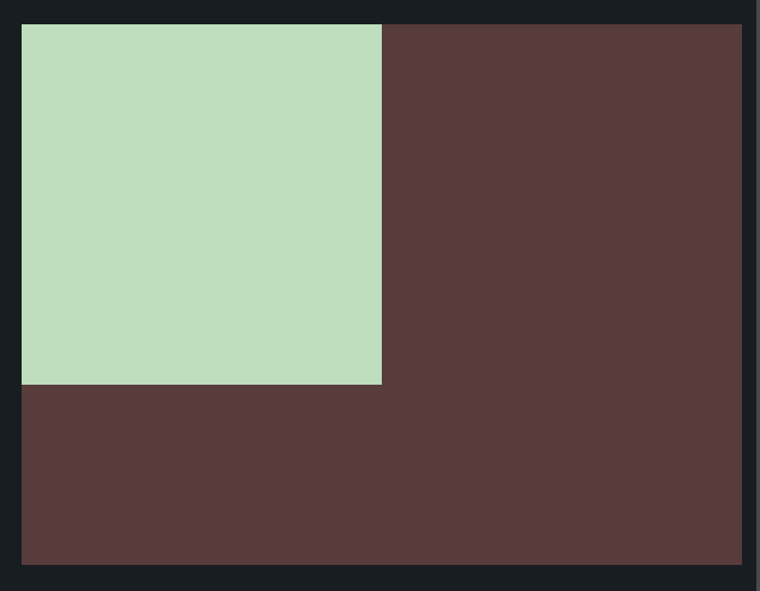

# CSS Battle: #1 - Pilot Battle

## #1 - Simply Square



```
<div></div>
<style>
  * {
    margin: 0;
    background: #5d3a3a;
  }
  div {
    width: 200px;
    height: 200px;
    background: #b5e0ba;
  }
</style>

```