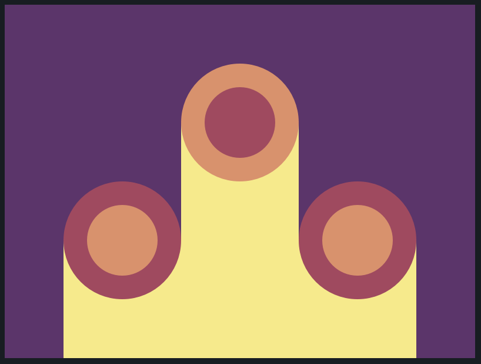

# CSS Battle: #1 - Pilot Battle

## #10 - Cloaked Spirits



```
<div class="cont">
  <div class="circle"></div>
</div>
<div class="cont mid">
  <div class="circle"></div>
</div>
<div class="cont">
  <div class="circle"></div>
</div>

<style>
  body {
    background: #62306D;
    display: flex;
    align-items: flex-end;
    justify-content: space-between;
    margin: 0 50px
  }
  div {
    width: 100px;
    height: 100px;
  }
  .cont {
    background: #F7EC7D;
    width: 33.3%;
    height: 100px;
  }
  .cont.mid {
    height: 200px;
  }
  .mid .circle {
    background: #AA445F;
    border-color: #E38F66;
  }
  .circle {
    background: #E38F66;
    width: 60px;
    height: 60px;
    border-radius: 50%;
    margin-top: -50%;
    border: 20px solid #AA445F;
  }
</style>
```