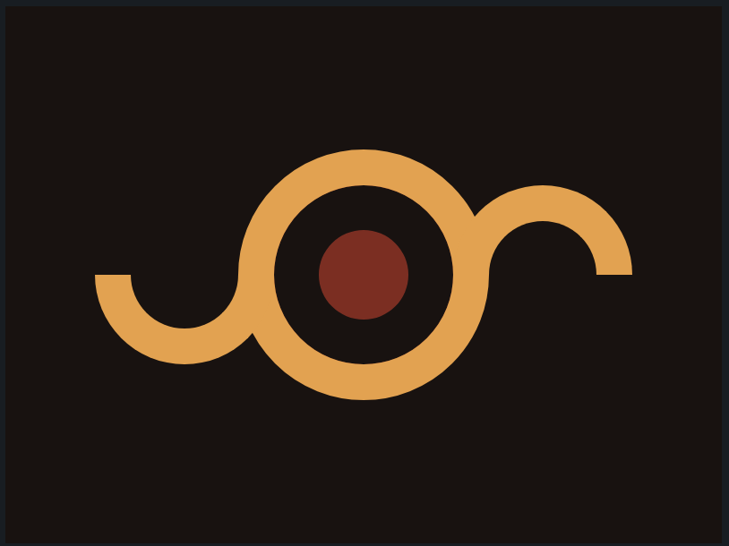

# CSS Battle: #1 - Pilot Battle

## #11 - Eye Of Sauron



```
<div class="cont">
  <div class="mid"></div>
  <div class="side"></div>
  <div class="side"></div>
</div>

<style>
  body {
    display: flex;
    justify-content: center;
    align-items: center;
    margin: 0;
    background: #191210;
  }
  .cont {
    background: #191210;
    display: grid;
    place-items: center;
    position: relative;
    width: 400px;
    height: 300px;
  }
  .mid {
    background: #ECA03D;
    position: reltive;
    width: 140px;
    height: 140px;
    border-radius: 50%;
  }
  .mid::after, .mid::before {
    left: 50%;
    top: 50%;
    position: absolute;
    border-radius: 50%;
    transform: translate(-50%, -50%);
    content: '';
  }
  .mid::after {
    background: #84271C;
    width: 50px;
    height: 50px;
  }
  .mid::before {
    background: #191210;
    width: 100px;
    height: 100px;
  }
  .side {
    position: absolute;
    background: #191210;
    width: 60px;
    height: 30px;
    left: 50px;
    top: 150px;
    border-right: 20px solid #ECA03D;
    border-left: 20px solid #ECA03D;
    border-bottom: 20px solid #ECA03D;
    border-radius: 0 0 50px 50px;
  }
  .side:nth-child(2) {
    left: 250px;
    top: 100px;
    transform: rotate(180deg);
  }
</style>
```