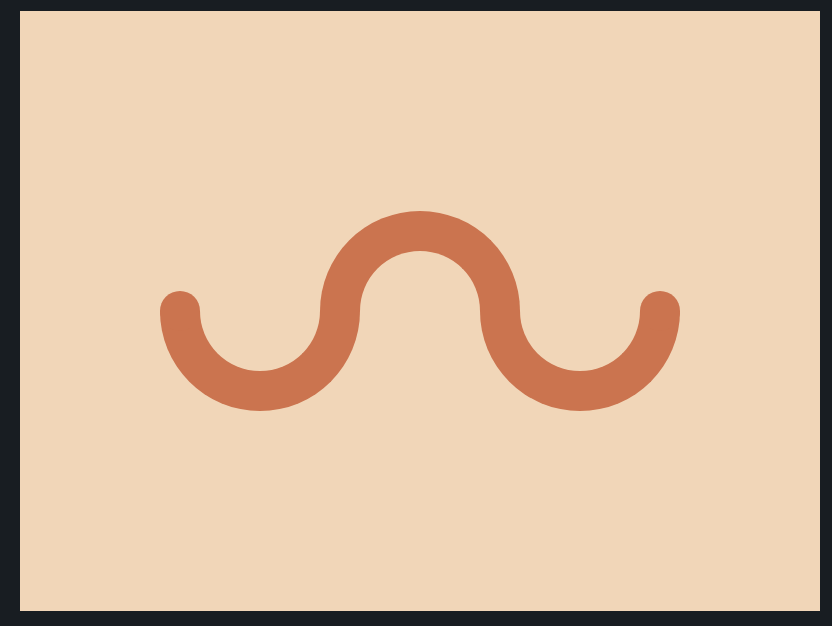

# CSS Battle: #1 - Pilot Battle

## #12 - Wiggly Moustache



```
<div class="circle">
  <div></div>
</div>
<div class="circle"></div>
<div class="circle">
  <div></div>
</div>

<style>
  body {
    margin: 0;
    background: #F5D6B4;
    display: flex;
    justify-content: center;
    align-items: center;
  }
  .circle {
    width: 60px;
    height: 30px;
    border: 20px solid #D86F45;
  }
  .circle:nth-of-type(odd) {
    border-radius: 0 0 99px 99px;
    border-top: none;
    margin-top: 50px;
  }
  .circle:nth-of-type(even) {
    border-radius: 99px 99px 0 0;
    border-bottom: none;
    margin: -50px -20px 0 -20px;
  }
  .circle:nth-of-type(1)>div {
    margin: -10px 0 0 -20px;
  }
  .circle:nth-of-type(3)>div {
    margin: -10px 0 0 60px;
  }
  .circle:nth-of-type(1)>div, .circle:nth-of-type(3)>div {
    background: #D86F45;
    width: 20px;
    height: 10px;
    border-radius: 99px 99px 0 0;
  }
</style>
```