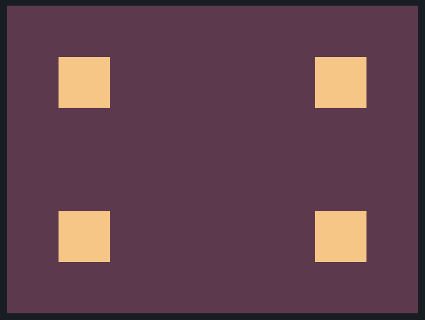

# CSS Battle: #1 - Pilot Battle

## #1 - Carrom



```
<div id="cont">
  <div class="box tl"></div>
  <div class="box tr"></div>
  <div class="box bl"></div>
  <div class="box br"></div>
</div>
<style>
  body {
    background: #62374e;
  }
  #cont {
    width: 300px;
    height:200px;
    margin: 50px auto;
    position: relative;
  }
  .box {
    width: 50px;
    height: 50px;
    background: #fdc57b;
    position: absolute;
  }
  .box.bl {
    bottom: 0;
  }
  .box.br {
    right: 0;
    bottom: 0;
  }
  .box.tr {
    right: 0;
  }
</style>
```