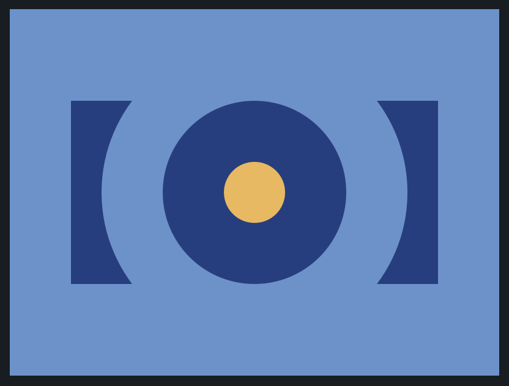

# CSS Battle: #1 - Pilot Battle

## #1 - Push Button



```
<div id="r">
	<div class="circle c1"></div>
	<div class="circle c2"></div>
	<div class="circle c3"></div>
</div>
<style>
  body {
    margin: 0;
    background: #6592CF;
  }
  #r {
    width: 300px;
    height: 150px;
    background: #243D83;
    position: relative;
  	margin: 75px auto;
  }
  .circle {
    border-radius: 50%;
    position: absolute;
  }
  .c1 {
    width: 250px;
    height: 250px;
    background: #6592CF;
    top: -50px;
    left: 25px
  }
  .c2 {
    width: 150px;
    height: 150px;
    background: #243D83;
    left: 75px;
  }
  .c3 {
    width: 50px;
    height: 50px;
    background: #EEB850;
    left: 125px;
    top: 50px
  }
</style>
```