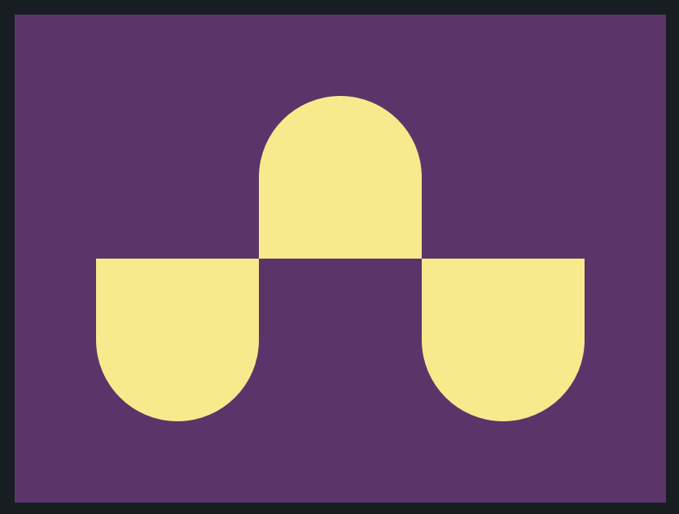

# CSS Battle: #1 - Pilot Battle

## #4 - Ups n Downs



```
<div class="cont">
  <div class="box one"></div>
  <div class="box two"></div>
  <div class="box three"></div>
</div>
<style>
  body {
    background: #62306D;
  }
  .cont {
    width: 300px;
    height: 200px;
    margin: 0 auto;
    padding-top: 42px;
    display: flex;
    justify-content: center;
  }
  .box {
    width: 100px;
    height: 100px;
    background: #F7EC7D;
  }
  .one, .three {
    margin-top: 100px;
  }
  .one {
    border-radius: 0% 0% 50% 50%;
  }
  .two {
    border-radius: 50% 50% 0% 0%;
  }
  .three {
    border-radius: 0% 0% 50% 50%;
  }
</style>
```