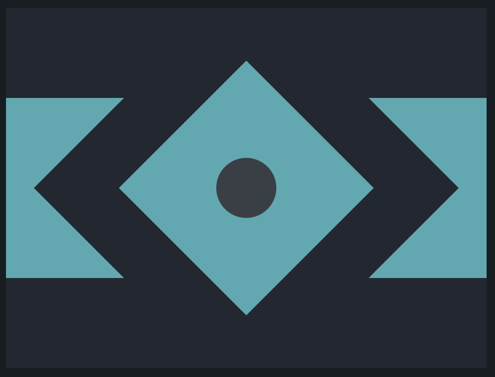

# CSS Battle: #1 - Pilot Battle

## #9 - Tesseract



```
<div id="cont">
  <div id="square">
	<div id="dot"></div>
  </div>
</div>

<style>
  body {
    margin: 0;
    background: #222730;
  }
  #cont {
    width: 100%;
    height: 150px;
    background: #4CAAB3;
    display: flex;
    justify-content: center;
    align-items: center;
    margin: 18.7% auto;
  }
  #square {
    width: 150px;
    height: 150px;
    background: #4CAAB3;
    transform: rotate(45deg);
    border: 50px solid #222730;
    background-clip: padding-box;
  }
  #dot {
    background: #393E46;
    width: 50px;
    height: 50px;
    border-radius: 50%;
    margin: 33%;
  }
</style>
```