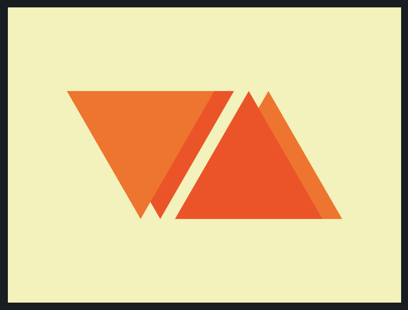

# CSS Battle: #2 - Visibility

## #14 - Web Maker Logo



```
<div class="cont">
  <div class="tri"></div>
  <div class="tri"></div>
  <div class="tri"></div>
  <div class="tri"></div>
</div>

<style>
  body {
    background: #F2F2B6;
    margin: 0;
  }
  .cont {
    width: 280px;
    height: 130px;
    position: relative;
    margin: 85px auto;
  }
  .tri {
    width: 0;
    height: 0;
    position: absolute;
    border-left: 75px solid transparent;
    border-right: 75px solid transparent;
    border-top: 130px solid #FF6D00;
    z-index: 1;
  }
  .tri:nth-child(2) {
    left: 20px;
    border-top-color: #FD4602;
    z-index: 0;
  }
  .tri:nth-child(3) {
    left: 110px;
    border-top-color: #FD4602;
    z-index: 1;
    transform: scaleY(-1);
  }
  .tri:nth-child(4) {
    left: 130px;
    z-index: 0;
    transform: scaleY(-1);
  }
</style>
```