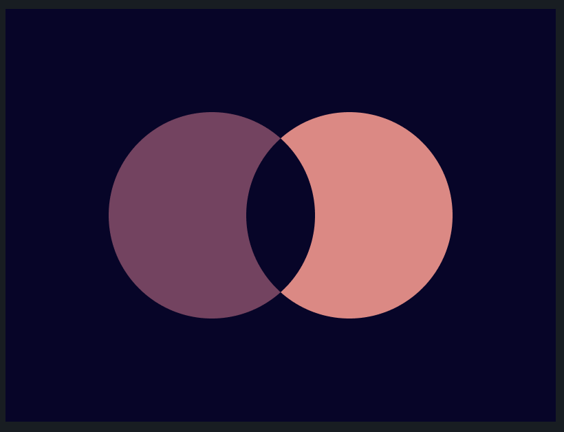

# CSS Battle: #2 - Visibility

## #15 - Overlap



```
<div class="circle"></div>
<div class="circle"></div>
<div class="center"></div>

<style>
  body {
    background: #09042A;
    display: flex;
    align-items: center;
    justify-content: center;
  }
  .circle {
    background: #7B3F61;
    width: 150px;
    height: 150px;
    border-radius: 50%;
  }
  .circle:first-child {
    margin-right: -50px;
  }
  .circle:nth-child(2) {
    background: #E78481;
  }
  .center {
    position: absolute;
    background: #09042A;
    border-top-right-radius: 75px;
    border-bottom-left-radius: 75px;
    transform: rotate(45deg);
    height: 80px;
    width: 80px;
  }
</style>
```