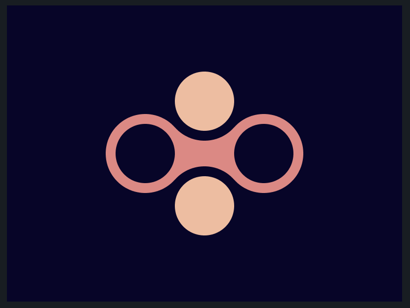

# CSS Battle: #2 - Visibility

## #17 - Fidget Spinner



```
<div class="circle1"></div>
<div class="mid"></div>
<div class="circle1"></div>
<div class="circle2 one"></div>
<div class="circle2 two"></div>

<style>
  body {
    background: #09042A;
    display: flex;
    align-items: center;
    justify-content: center;
  }
  .circle1 {
    width: 80px;
    height: 80px;
    border: 10px solid #E78481;
    border-radius: 50%;
    box-sizing: border-box;
  }
  .circle2 {
    width: 80px;
    height: 80px;
    background: #F5BB9C;
    position: absolute;
    border: 10px solid #09042A;
    border-radius: 50%;
    box-sizing: border-box;
  }
  .circle2.one {
    top: 57px;
  }
  .circle2.two {
    bottom: 57px;
  }
  .mid {
    background: #E78481;
    width: 60px;
    height: 50px;
    border-radius: -50px;
    margin-left: -10px;
    margin-right: -10px;
  }
</style>
```