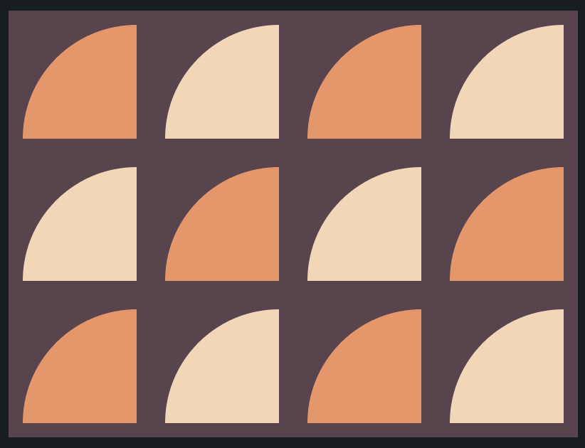

# CSS Battle: #2 - Visibility

## #18 - Matrix



```
<div></div>
<div></div>
<div></div>
<div></div>
<div class="matrix"></div>
<div class="matrix"></div>
<div class="matrix"></div>
<div class="matrix"></div>
<div></div>
<div></div>
<div></div>
<div></div>

<style>
  body {
    margin: 10px;
    background: #5C434C;
    display: grid;
    grid-template-columns: repeat(4, auto);
    grid-template-rows: repeat(3, auto);
    grid-gap: 20px;
  }
  div {
    width: 80px;
    height: 80px;
    border-top-left-radius: 100%;
  }
  div:nth-child(even), .matrix:nth-child(odd) {
    background: #F5D6B4;
  }
  div:nth-child(odd), .matrix:nth-child(even) {
    background: #F09462;
  }
</style>
```