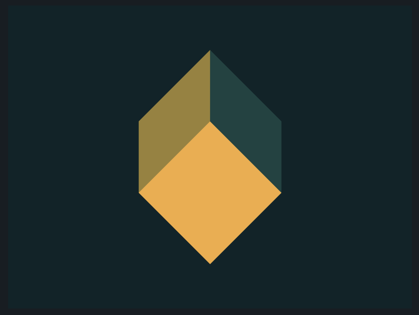

# CSS Battle: #3 - Cursor

## #19 - Cube



```
<div class="cube1"></div>
<div class="cube2"></div>
<div class="cube3"></div>

<style>
  body {
    background: #0B2429;
  }
  .cube1 {
    position: absolute;
    width: 100px;
    height: 100px;
    background: #F3AC3C;
    bottom: 65px;
    left: 150px;
    transform: rotate(45deg);
  }
  .cube2 {
    position: absolute;
    left: auto;
    right: 200px;
    background: #998235;
    transform: skewY(-45deg);
  }
  .cube3, .cube2 {
    position: absolute;
    background: #1A4341;
    left: 200px;
    bottom: 150px;
    transform: skewY(45deg);
    width: 70px;
    height: 70px;
  }
</style>
```