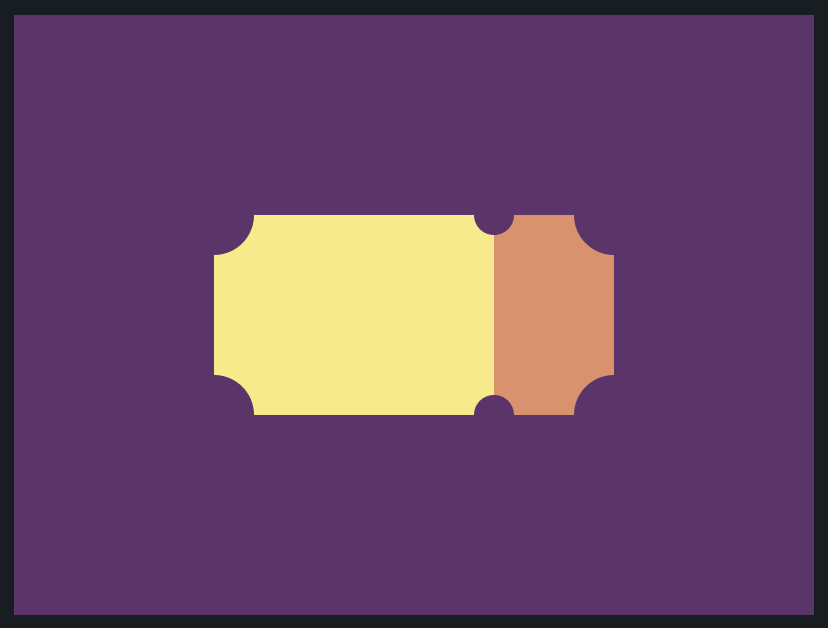

# CSS Battle: #3 - Cursor

## #20 - Ticker



```
<div class="left"></div>
<div class="right"></div>
<style>
  body {
    background-color: #62306D;
    display: flex;
    justify-content: center;
    align-items: center;
  }
  div {
    width: 100px;
    height: 100px;
  }
  .left {
    background-color: #F7EC7D;
    width: 140px;
  }
  .right {
    background-color: #E38F66;
    width: 60px;
  }
  .left:before {
    box-shadow: 200px 0px #62306D, 0px 100px #62306D, 200px 100px #62306D, 140px 0px 0px -10px #62306D, 140px 100px 0px -10px #62306D;
    background: #62306D;
    position: relative;
    content: "";
    display: block;
    width: 40px;
    height: 40px;
    border-radius: 50%;
    right: 20px;
    bottom: 20px;
  }
</style>
```
